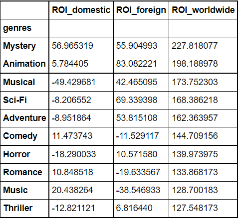
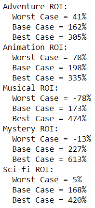
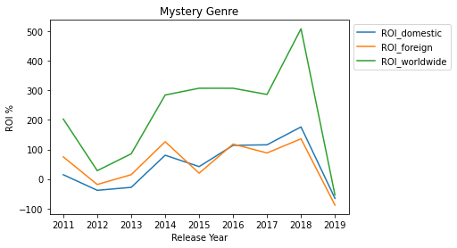
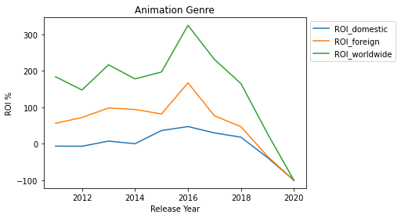
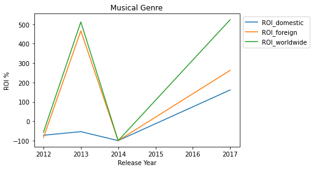
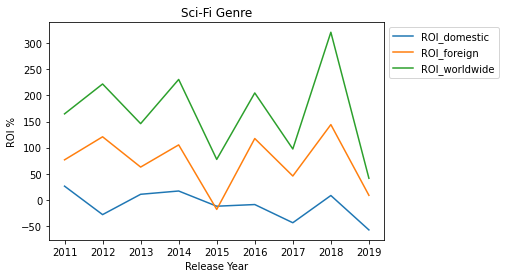
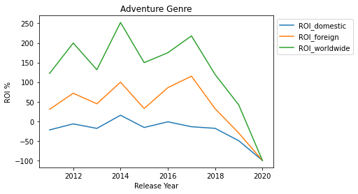

# Phase 1 Project
## Microsoft Movie Studio Genre - R.O.I. Analysis

**Author**: Samantha Baltodano, Jesus Baquiax, Senjin Jang, Shane Mangold

## Overview 

This project analyzes which movie genres Microsoft's Movie Studios should invest their resources in producing using exploratory data analysis. Microsoft can use this analysis to determine which genres have the greatest worldwide Return On Investment (R.O.I), how the R.O.I. performs in domestic vs international markets, and which directors and producers have worked in the movies with the highest R.O.I.

## Business Problem

Microsoft sees all the big companies creating original video content and they want to get in on the fun. They have decided to create a new movie studio, but they don’t know anything about creating movies. You are charged with exploring what types of films are currently doing the best at the box office. You must then translate those findings into actionable insights that the head of Microsoft's new movie studio can use to help decide what type of films to create.

### The Data

Data was gather from IMDB's public database available for download at 
IMDB which is an online database of information related to films, television programs, home videos, video games, and streaming content online.

* [IMDB](https://datasets.imdbws.com)

### Methods

This project uses descriptive analysis and visualizations including trends over time. This project provides Microsoft a useful overview of a genre's R.O.I. The three questions explored are:

1) Which genres should we create films in? Which genres provide the highest average ROI?

2) Does the average ROI by genre follow a similar trend when compared between domestic and foreign markets?

3) Is there any relationship between directors' performance and movies' success?

### Results

1) The 5 genres with the greatest worldwide R.O.I. are Mystery, Animation, Musical, Sci-Fi, and Adventure. We have also forecasted the best, base, and worst case scenario for each top 5 genre. Musicals and Mysteries have negative % worst case scenarios. On base average level, each genre will return at least a 150% R.O.I. and the Mystery genre has the strongest best case scenario with a possible 613% R.O.I. Finally, a boxplot illustrates each genre's R.O.I.'s performance. 

2) Exploring the foreign R.O.I. vs. the domestic R.O.I. for each of the top 5 genres, Mystery is the only genre that on average performs on a similar wavelength for domestic and foreign markets. The foreign R.O.I. for the other genres is greater than the domestic R.O.I. to various degrees. The average domestic R.O.I. for Musical, Sci-Fi, and adventure is a negative % return.

3) Finally, there is no strong correlation between the number of movies that directors have been involved or the specific directors themselves and profits. The director's who made 5 or more movies in our date range did not make the most profitable movies. However, they also did not lose money and made steady and modest profits. Second, the most profitable movies were made by directors who produced 1 to 3 movies in that time. These movies did subtantially better than others, and therefore we could look deeper into them to find more insights

## Conclusions

Our three recommendations to Microsoft's Movie Studio is to focus on:

1) From what we see in the graphs above and based on worst, base, and best case scenarios for each genre, we should create films in the **adventure and animation** genres. Although their best case ROI predictions are not as high as the mystery and musical genres, their worst case ROI predications are both far above 0%.

All movies, no matter the genre, should be released worldwide and not just domestically, the worst case ROI predictions for each of the top 5 genres with highest average domestic ROI is below -25%

2) The average ROI for the top 5 genres over the past decade shows that there is a bigger return on investment in the foreign market vs the domestic market for Adventure, Sci-Fi, Animation, and potentially Musical movies. The Mystery Genre's domestic and foreign ROI follow the same general positive trend over time.

Each genre's domestic ROI hovers around 0% except for Mystery movies that generally maintains a postive trajectory. There are a few outliers in the musical and mystery genre, but the foreign ROI generally performs better than the domestic ROI.

Based on this section of the analysis, Microsoft's movie studios should focus on producing **Adventure, Sci-Fi, and Animation** movies because of their greater foreign ROI potential

**NOTE ON MUSICAL GENRE**:
Initially, the musical genre seems to provide a substantial R.O.I. at first glance, but two caveats that should be named is that 1) There have been only 6 musical movies since 2010 and 2) The last musical movie was released back in 2017 which explains the continued upward trajetory it has which differs from the other genres.  

3) there is no correlation between director choice and a film's success. Film directors cannot me considered a characteristic of success, because there is no corelation between profits and director choice. Directors with experience directing five or more films do not have a higher profits on average. The director of a film is not a characteristic of the success of a film.

More research will need to be done on the characteristics that impact successful films, but from our preliminary research it's clear that the genre choice and the film's reach have a direct impact on success and must be considered when deciding which type of movies we will create.

### Next Steps

Further analysis...

### For More Information(?)

links to articles that might add to our project

### Repository Structure(?)

