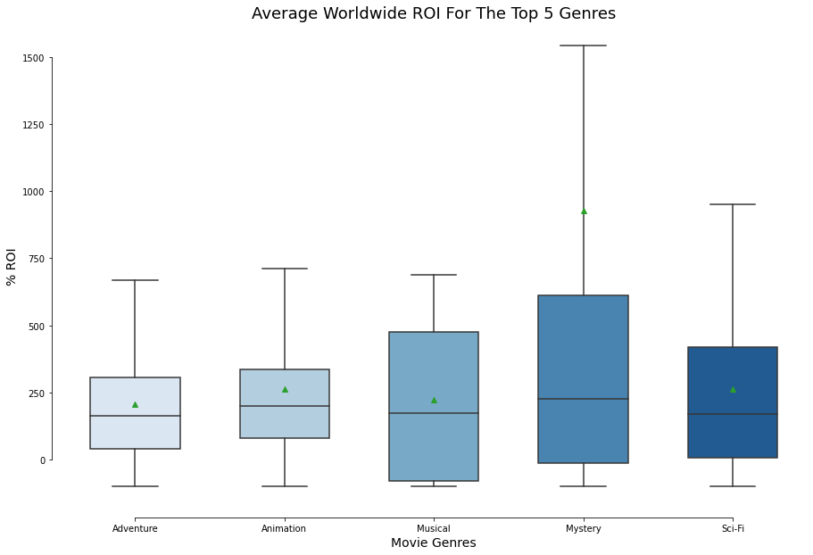

# Phase 1 Project
## Microsoft Movie Studio Genre - R.O.I. Analysis

**Author**: Samantha Baltodano, Jesus Baquiax, Shane Mangold, Senjin Yang

## Overview 

This project analyzes which movie genres Microsoft's Movie Studios should invest their resources in producing using exploratory data analysis. Microsoft can use this analysis to determine which genres have the greatest worldwide Return On Investment (R.O.I), how the R.O.I. performs in domestic vs international markets, and which directors and producers have worked in the movies with the highest R.O.I.

## Business Problem

Microsoft sees all the big companies creating original video content and they want to get in on the fun. They have decided to create a new movie studio, but they don’t know anything about creating movies. You are charged with exploring what types of films are currently doing the best at the box office. You must then translate those findings into actionable insights that the head of Microsoft's new movie studio can use to help decide what type of films to create.

### The Data

The movie datasets we used:

* [Box Office Mojo](https://www.boxofficemojo.com/)
* [IMDB](https://www.imdb.com/)
* [TheMovieDB](https://www.themoviedb.org/)
* [The Numbers](https://www.the-numbers.com/)
* API call to IMDB(?)

The group combined 

### Methods

This project uses descriptive analysis and visualizations including trends over time. This project provides Microsoft a useful overview of a genre's R.O.I. The three questions explored are:

1) Which genres should we create films in? Which genres provide the highest average ROI?

2) Does the average ROI by genre follow a similar trend when compared between domestic and foreign markets?

3) Is there any particular director/producer who appears frequently in the top 50 movies over the past 10 years?

### Results

1) The 5 genres with the greatest worldwide R.O.I. are Mystery, Animation, Musical, Sci-Fi, and Adventure. We have also forecasted the best, base, and worst case scenario for each top 5 genre. Musicals and Mysteries have negative worst case scenarios. On base average level, each genre will return at least a 150% R.O.I. and the Mystery genre has the strongest best case scenario with a possible 613% R.O.I. Finally, a boxplot illustrates each genre's R.O.I.'s performance. 

2) 

3)

## Conclusions

Our three recommendations to Microsoft's Movie Studio is to focus on:

1) From what we see in the graphs above and based on worst, base, and best case scenarios for each genre, we should create films in the **adventure and animation** genres. Although their best case ROI predictions are not as high as the mystery and musical genres, their worst case ROI predications are both far above 0%.

All movies, no matter the genre, should be released worldwide and not just domestically, the worst case ROI predictions for each of the top 5 genres with highest average domestic ROI is below -25%

2) The average ROI for the top 5 genres over the past decade shows that there is a bigger return on investment in the foreign market vs the domestic market for Adventure, Sci-Fi, Animation, and potentially Musical movies. The Mystery Genre's domestic and foreign ROI follow the same general positive trend over time.

Each genre's domestic ROI hovers around 0% except for Mystery movies that generally maintains a postive trajectory. There are a few outliers in the musical and mystery genre, but the foreign ROI generally performs better than the domestic ROI.

Based on this section of the analysis, Microsoft's movie studios should focus on producing **Adventure, Sci-Fi, and Animation** movies because of their greater foreign ROI potential

NOTE ON MUSICAL GENRE:
Initially, the musical genre seems to provide a substantial R.O.I. at first glance, but two caveats that should be named is that 1) There have been only 6 musical movies since 2010 and 2) The last musical movie was released back in 2017 which explains the continued upward trajetory it has which differs from the other genres.  

3)

### Next Steps

Further analysis...

### For More Information(?)

links to articles that might add to our project

### Repository Structure(?)

