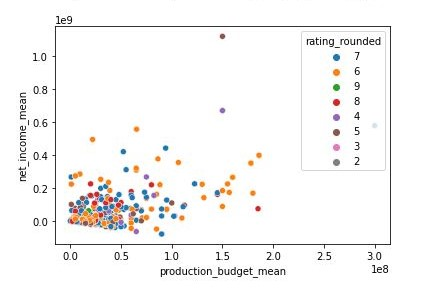
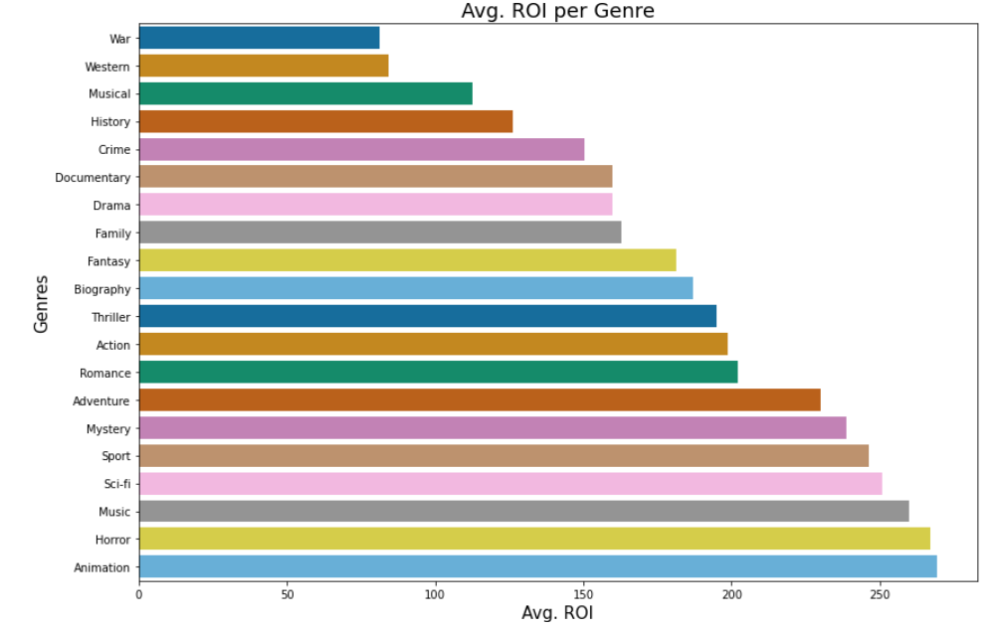
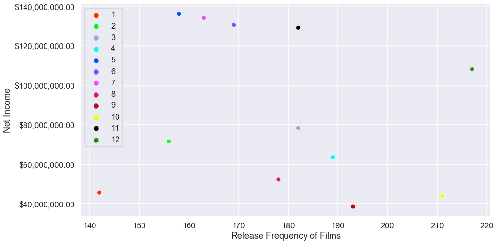

## Business Problem
Microsoft is planning to venture into film production by opening a new studio and need actionable insights into movie data to determine which films to produce in order to succeed at the box office.  

We will clean, assemble, interpret, and visualize data from the given data sets in order to provide recommendations for business decisions.  

### Contents and Data

In the folder `zippedData` are movie datasets from:

* [Box Office Mojo](https://www.boxofficemojo.com/)
* [IMDB](https://www.imdb.com/)
* [Rotten Tomatoes](https://www.rottentomatoes.com/)
* [TheMovieDB](https://www.themoviedb.org/)
* [The Numbers](https://www.the-numbers.com/)  

`images` contains all images used in our presentation and notebooks.  
`notebooks` contains all independent EDA notebooks created to combine into the final notebook file.

### Business Understanding  
  
In order to provide specific recommendations, we selected several metrics:    
-Producers  
	- Which producers create consistently the best-rated films?
	- Along with their film ratings, which producers have the largest margins between production budget and box office income? 
-Genres  
	- Creating movies in popular genres will attract more initial viewers.
	- Comparing film genres with their overhead costs and ROIs can provide insights on which types of films could be profitable.  
-Release Dates  
	- Viewership will impact the film's overall income and releasing films during peak seasons or months can increase viewership.
	- Exploring the frequency of film releases throughout the year can also provide insights on when other studios are releasing movies and how to address competing films.
	

## Methods   
### Exploratory Data Analysis (EDA):  
-We examined each individual data set to find metrics to support the topics we are addressing. We then looked for correlations in dataframes to create subsets
of usable data to visualize. 

### Data Understanding:  
-We found correlation between producers, the titles and genres of the films they produced, and financial information to support our topics.
-Using descriptive statstics, we were able to better understand the connection between metrics such as genre, release date, and producer. 

### Evaluation: 
Producers: 
This graph represents the intersection of the budget averages, net income averages, and mean movie rating averages for all producers.  
The intersection of the lowest budget average, highest net income and highest rating could deliver the strongest choice of producer.  

 

Genres:
This graph represents return on investment by genre.  
Genres with the highest ROI would suggest higher viewership counts, historically.  
  
  

Release Dates:  
This graph represents each month by its net income (y-axis) versus the frequency of films released during that month.
Releasing films during months with high net income but low release frequency could address issues of competition and yield higher income.  

  

Summary: 

  

 
Through this data analysis, we are able to provide several recommendations based on our measures of success:  
-While there is a general upward trend with return on production budget, it is possible to select a producer with higher profit margins based on their previous films.
-Animation, fantasy, and adventure genres for films historically have a higher potential to net positive.
-Summer film releases are the most succesful for a high net income. 

### Conclusion:
This data can be useful to finetune selections based on individual budget, staffing, and style limitations. 

Our recommendations look to minimize budget and maximize net income but depending on individual goals, the information allows to explore other intersections.

